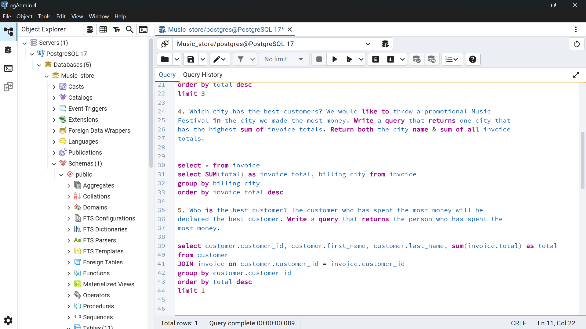
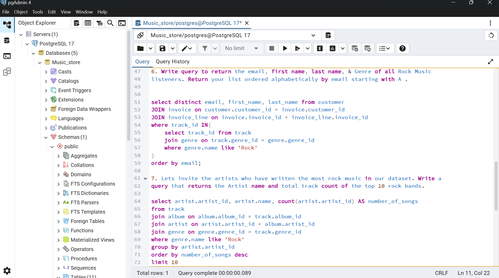

# Music-Store-SQL-Project
SQL project on Music Store dataset – performed data analysis using joins, grouping, aggregation, and subqueries in PostgreSQL.

# 🎵 Music Store SQL Project

## 📌 Project Overview
This project analyzes a **digital music store database** using **PostgreSQL**.  
The goal was to solve business questions using SQL queries involving joins, aggregations, grouping, filtering, and subqueries.

---

## 🔎 Questions Solved
1. Who is the senior most employee based on job title?  
2. Which countries have the most invoices?  
3. What are the top 3 invoice totals?  
4. Which city has the best customers (highest total invoice value)?  
5. Who is the best customer (highest spending)?  
6. List of Rock music listeners with email and name.  
7. Top 10 artists who produced the most Rock tracks.  
8. Tracks longer than the average track length.  

---

## 🛠️ Tech Used
- PostgreSQL  
- pgAdmin 4  

---

## 📂 Files in this Repository
- `music_store_project.sql` → contains all SQL queries  
- `./q1_q2_q3_queries.png`, `./q4_q5_queries.png`, `./q6_q7_queries.png` → screenshots of queries in pgAdmin  

---

## 📸 Screenshots
  
  
  

---

## 🚀 Insights
- The USA generated the highest number of invoices.  
- Prague had the best customers in terms of spending.  
- The top customer spent over \$40.  
- Rock genre dominates with maximum track count.  

---

## 👩‍💻 Author
[Berrina] – Aspiring Data Analyst | Skilled in SQL, Excel, and Data Visualization  
